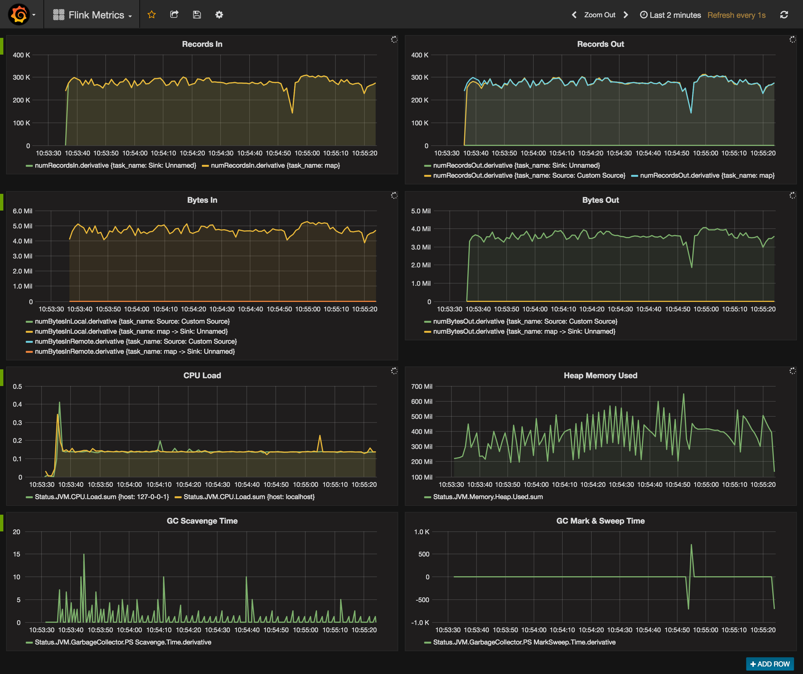

InfluxDB Metrics Reporter for Apache Flink
=============
This project is just some glue code and configuration to reuse [metrics-influxdb](https://github.com/davidB/metrics-influxdb) in Apache Flink.

To use it add the following configuration to your flink-conf.yaml file and place the JAR this project
builds into your flink/lib directory:

    metrics.reporters: influxdb
    metrics.reporter.influxdb.server: localhost
    metrics.reporter.influxdb.port: 8086
    metrics.reporter.influxdb.user: admin
    metrics.reporter.influxdb.password: admin
    metrics.reporter.influxdb.db: flink
    metrics.reporter.influxdb.class: com.jgrier.flinkstuff.metrics.InfluxDbReporter
    metrics.reporter.influxdb.interval: 10 SECONDS
    
    # metrics format: host.process_type.tm_id.job_name.task_name.subtask_index
    
    metrics.scope.jm: <host>.jobmanager.na.na.na.na
    metrics.scope.jm.job: <host>.jobmanager.na.<job_name>.na.na
    metrics.scope.tm: <host>.taskmanager.<tm_id>.na.na.na
    metrics.scope.tm.job: <host>.taskmanager.<tm_id>.<job_name>.na.na
    metrics.scope.tm.task: <host>.taskmanager.<tm_id>.<job_name>.<task_name>.<subtask_index>
    metrics.scope.tm.operator: <host>.taskmanager.<tm_id>.<job_name>.<task_name>.<subtask_index>

This along with InfluxDB and Grafana allows you to monitor Apache Flink with nice dashoboards like the following:

